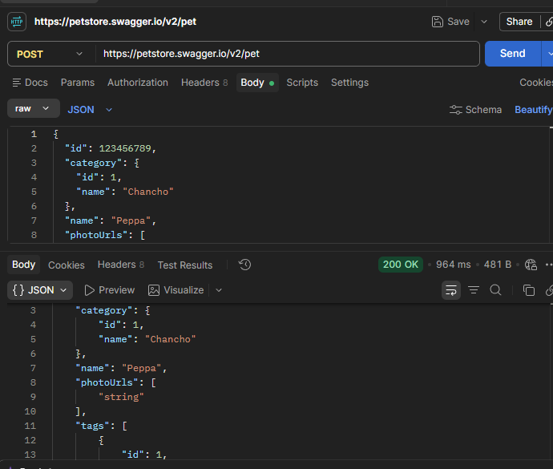
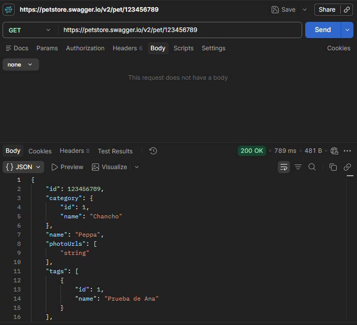
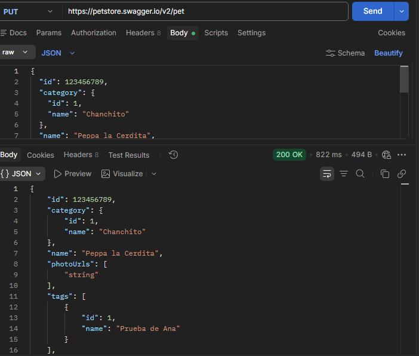
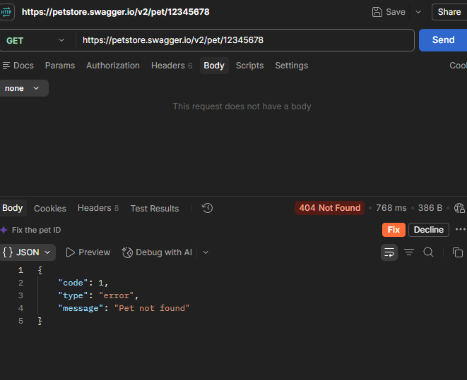
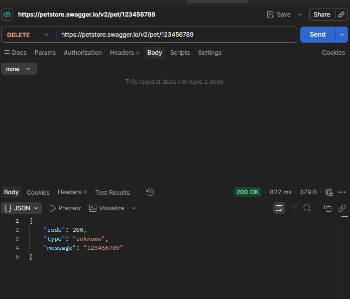
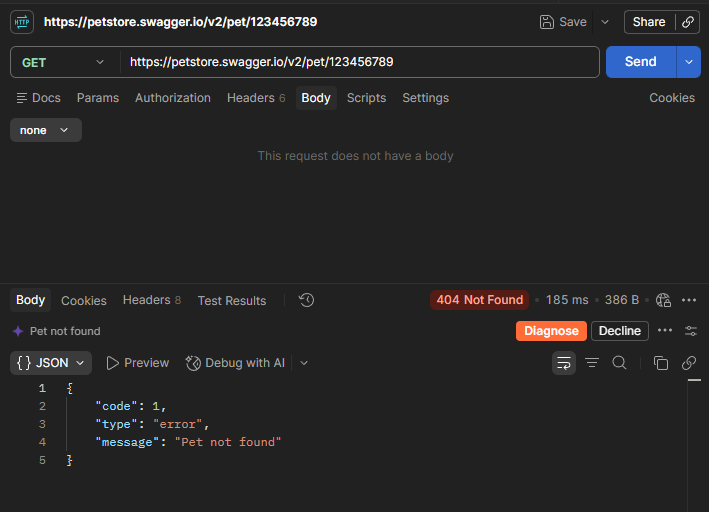

# API Testing — Casos de prueba

## Caso API-01 — Alta de mascota

**Objetivo:**  
Verificar que la API permita registrar correctamente una nueva mascota utilizando datos válidos.

**Operación y endpoint:**  
POST /pet

**Precondiciones:**  
Utilizar un identificador diferenciado para reducir la posibilidad de interferencias con otros usuarios del ambiente público de Swagger Petstore.

**Datos de entrada:**

```json
{
  "id": 123456789,
  "category": {
    "id": 1,
    "name": "Chancho"
  },
  "name": "Peppa",
  "photoUrls": [
    "string"
  ],
  "tags": [
    {
      "id": 1,
      "name": "Prueba de Ana"
    }
  ],
  "status": "available"
}
```

**Resultado esperado:**  
La API debe registrar correctamente la mascota y devolver una respuesta exitosa con los mismos datos enviados.

**Resultado obtenido:**  
La API respondió con código HTTP 200 OK y devolvió correctamente la información de la mascota registrada, incluyendo el ID 123456789, la categoría "Chancho", el nombre "Peppa" y el estado "available".

**Estado:**  
PASÓ

**Evidencia:**  


---

## Caso API-02 — Consulta de mascota existente

**Objetivo:**  
Verificar que sea posible consultar una mascota previamente registrada utilizando su identificador.

**Operación y endpoint:**  
GET /pet/123456789

**Precondiciones:**  
La mascota con ID 123456789 debe haber sido registrada previamente.

**Datos de entrada:**  
ID de mascota: 123456789

**Resultado esperado:**  
La API debe devolver la mascota correspondiente al identificador consultado y mostrar los datos registrados previamente.

**Resultado obtenido:**  
La API respondió con código HTTP 200 OK y devolvió correctamente la mascota con ID 123456789. Los datos obtenidos coincidieron con la información registrada anteriormente, incluyendo la categoría "Chancho", el nombre "Peppa" y el estado "available".

**Estado:**  
PASÓ

**Evidencia:**  


---

## Caso API-03 — Modificación de mascota

**Objetivo:**  
Verificar que la API permita modificar correctamente los datos de una mascota existente.

**Operación y endpoint:**  
PUT /pet

**Precondiciones:**  
La mascota con ID 123456789 debe existir previamente.

**Datos de entrada:**

```json
{
  "id": 123456789,
  "category": {
    "id": 1,
    "name": "Chanchito"
  },
  "name": "Peppa la Cerdita",
  "photoUrls": [
    "string"
  ],
  "tags": [
    {
      "id": 1,
      "name": "Prueba de Ana"
    }
  ],
  "status": "available"
}
```

**Resultado esperado:**  
La API debe actualizar los datos de la mascota y devolver la información modificada.

**Resultado obtenido:**  
La API respondió con código HTTP 200 OK y devolvió correctamente los datos actualizados de la mascota. Se verificó el cambio de la categoría de "Chancho" a "Chanchito" y del nombre de "Peppa" a "Peppa la Cerdita", manteniendo el estado "available".

**Estado:**  
PASÓ

**Evidencia:**  


---

## Caso API-04 — Consulta de mascota inexistente

**Objetivo:**  
Verificar el comportamiento de la API cuando se intenta consultar una mascota con un identificador inexistente.

**Operación y endpoint:**  
GET /pet/{petId}

**Precondiciones:**  
Utilizar un identificador que no corresponda a una mascota existente.

**Datos de entrada:**  
ID inexistente.

**Resultado esperado:**  
La API debe informar que la mascota solicitada no fue encontrada.

**Resultado obtenido:**  
La API respondió indicando correctamente que la mascota consultada no existe.

**Estado:**  
PASÓ

**Evidencia:**  


---

## Caso API-05 — Eliminación de mascota

**Objetivo:**  
Verificar que la API permita eliminar correctamente una mascota existente.

**Operación y endpoint:**  
DELETE /pet/123456789

**Precondiciones:**  
La mascota con ID 123456789 debe existir antes de ejecutar la operación de eliminación.

**Datos de entrada:**  
ID de mascota: 123456789

**Resultado esperado:**  
La API debe procesar correctamente la eliminación de la mascota.

**Resultado obtenido:**  
La API respondió correctamente a la solicitud de eliminación de la mascota.

**Estado:**  
PASÓ

**Evidencia:**  


---

## Caso API-06 — Verificación posterior a la eliminación

**Objetivo:**  
Verificar que una mascota eliminada ya no pueda ser recuperada mediante su identificador.

**Operación y endpoint:**  
GET /pet/123456789

**Precondiciones:**  
La mascota con ID 123456789 debe haber sido eliminada previamente mediante DELETE /pet/{petId}.

**Datos de entrada:**  
ID de mascota: 123456789

**Resultado esperado:**  
La API debe informar que la mascota ya no existe.

**Resultado obtenido:**  
La API confirmó que la mascota eliminada ya no se encuentra disponible.

**Estado:**  
PASÓ

**Evidencia:**  


---

# Conclusiones

## Resultados relevantes

Las operaciones seleccionadas dentro de la gestión de mascotas funcionaron de acuerdo con lo esperado. Fue posible registrar una mascota, consultarla mediante su identificador, modificar sus datos y posteriormente eliminarla.

También se verificó el comportamiento de la API ante la consulta de un identificador inexistente y luego de la eliminación de la mascota.

Durante las pruebas se validaron tanto los códigos de estado HTTP como los datos y la estructura de las respuestas obtenidas.

## Limitaciones

Swagger Petstore corresponde a un entorno público de demostración, por lo que otros usuarios pueden crear, modificar o eliminar información en el mismo ambiente.

Esto puede generar interferencias si distintos usuarios utilizan identificadores iguales o similares.

## Pruebas adicionales

Si se dispusiera de más tiempo, se podrían realizar pruebas adicionales como:

- Alta de mascota con campos obligatorios incompletos.
- Envío de tipos de datos inválidos.
- Eliminación de una mascota inexistente.
- Modificación de una mascota inexistente.
- Pruebas con diferentes estados de mascota.
- Búsqueda de mascotas por estado.
- Carga de imágenes.